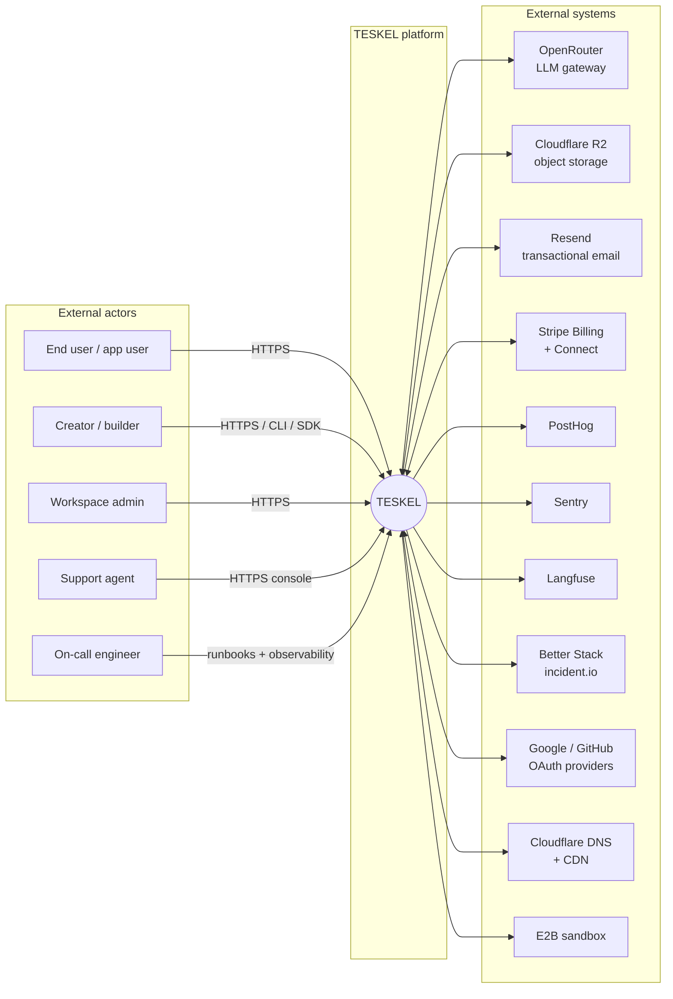
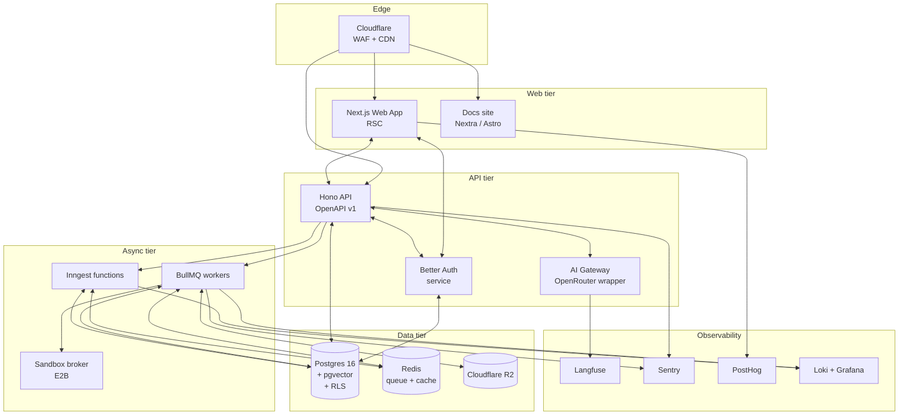
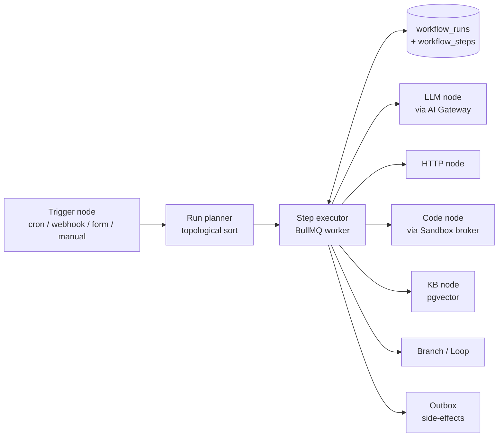
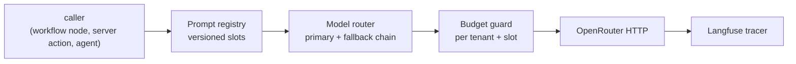
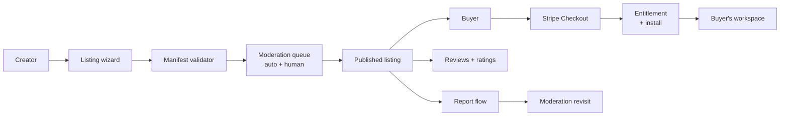
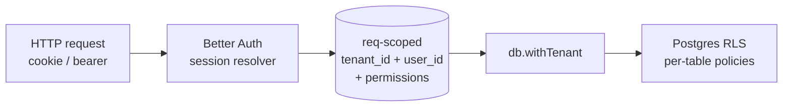

# TESKEL — C4-Light architecture

> **Status:** Living. Updated when a new bounded context is added or
> when an ADR materially changes a container.
>
> **Governed by:** ADR-0001..0010 (initial wave) and Plan §16–§34.

This document is the **C4-Light** view of TESKEL. We use only three
levels: System Context, Container, Component. We deliberately skip
the Code level — that lives in `packages/*/README.md`.

For the *deeper* per-surface reasoning, follow the cross-links to
[`docs/adr/`](../adr/), [`multi-tenancy.md`](./multi-tenancy.md), and
[`threat-model.md`](./threat-model.md).

---

## 1. System Context (Level 1)

**TESKEL** is a multi-tenant AI-native SaaS platform that:

1. Lets *creators* compose AI workflows + UI + data into running apps.
2. Hosts those apps and runs their workflows for *end users*.
3. Operates a *marketplace* where creators distribute templates and
   are paid via Stripe Connect.

The surfaces, in execution order at the boundary:

- **Web app** (`apps/web`) — Next.js 15 App Router, Server-first.
- **API** (`apps/api`) — Hono, internal SDK, public OpenAPI v1.
- **Workers** (`apps/workers`) — BullMQ consumers; Inngest for
  step.run cron + event-driven workflows.
- **Sandbox** (`apps/sandbox-broker` + E2B) — runs user-supplied code
  with strict policy.

---

## 2. Containers (Level 2)

### Container responsibilities

| Container | Tech | Owner | Responsibilities |
| --- | --- | --- | --- |
| `apps/web` | Next.js 15 (App Router, RSC), Tailwind, shadcn/ui | Frontend | All user-facing UX; Server Components by default; `use client` only at leaves. |
| `apps/docs-site` | Nextra (or Astro Starlight) | Docs | Public docs, API reference, marketplace landing. |
| `apps/api` | Hono + Zod + Drizzle | Backend | Public OpenAPI v1, internal SDK; thin handlers, work delegated to services. |
| `apps/workers` | BullMQ | Backend | Async work: workflow runs, email send, exports, backfills. |
| `apps/sandbox-broker` | thin proxy to E2B | Platform | Provisions sandboxes for `code` workflow nodes; enforces network egress + CPU/mem caps. |
| `services/auth` | Better Auth | Identity | Sessions, orgs, 2FA, passkey, SAML/SCIM (Phase 4). |
| `services/ai-gateway` | OpenRouter wrapper + Langfuse | AI | Single egress point for LLM calls; budget, retry, fallback chain. |
| `packages/db` | Drizzle ORM + migrations | Backend | Schema, RLS, `db.withTenant`, generated types. |
| `packages/queue` | BullMQ + outbox | Backend | Outbox pattern, idempotency keys, DLQ. |
| `packages/integrations/*` | Typed clients | Backend | One package per third-party (Stripe, Resend, OpenRouter, Slack, …). |
| `packages/ui` | shadcn/ui-style components | Frontend | Design system, tokens, primitives. |
| `packages/blocks` | Puck blocks | Frontend | Visual builder block library. |
| `packages/sdk` | Auto-generated from OpenAPI | DX | Public SDK for end users / scripts. |
| `packages/cli` | Commander + SDK | DX | `teskel init`, `teskel deploy`, … |

---

## 3. Components (Level 3) — selected surfaces

Only the surfaces that are non-obvious are drawn here. Trivial CRUD
APIs are intentionally omitted — they follow the same shape as
`add-api-route` skill.

### 3.1 Workflow runtime

Hard rules — see [`AGENTS.md` §8](../../AGENTS.md#8-architecture-hard-rules):

- Every step is **idempotent**. Step is identified by
  `(run_id, step_index, attempt)`.
- Every external side effect goes through the **outbox**. The worker
  writes the outbox row in the same transaction that advances the
  step, then a separate sender flushes it.
- Cancelling a run is **best effort**: in-flight LLM/HTTP calls run to
  completion, but no further steps are scheduled.
- Worker restart **resumes** runs from the last persisted step.

### 3.2 AI gateway

- No vendor SDK is imported from product code. Calls go through the
  registry → router → gateway pipeline.
- A slot has: `id`, `version`, `input_schema`, `output_schema`,
  `primary_model`, `fallback_chain`, `temperature`, `max_tokens`,
  `eval_set`. See `add-prompt-slot` skill.
- Budget is checked **before** the call. Caller gets `BUDGET_EXCEEDED`
  with the next-window reset time.

### 3.3 Marketplace (Phase 3)

See [`docs/marketplace/manifest-spec.md`](../marketplace/manifest-spec.md)
and `publish-template` skill.

### 3.4 Identity (Better Auth + RLS)

See [`multi-tenancy.md`](./multi-tenancy.md) and
[`docs/security/rbac-matrix.md`](../security/rbac-matrix.md).

---

## 4. Cross-cutting

| Concern | How |
| --- | --- |
| Multi-tenancy | RLS policies per table, `db.withTenant(tenantId)` on every code path that reaches the DB. See [`multi-tenancy.md`](./multi-tenancy.md). |
| Idempotency | `Idempotency-Key` header for mutating API; `(run_id, step_index)` for workflow steps. See [`docs/api/idempotency.md`](../api/idempotency.md). |
| Outbox | `outbox_events` table written in the same TX as the row that triggers the side effect; flusher worker calls integrations. |
| Secrets | Env at boundary, validated by Zod once at boot. See [`docs/security/secrets.md`](../security/secrets.md). |
| Observability | Sentry (errors), Loki + Grafana (logs + metrics), PostHog (product), Langfuse (LLM). Every span carries `tenant_id` + `run_id`. |
| Compliance | RLS + audit log + retention policy + DSAR pipeline. See [`docs/data/retention.md`](../data/retention.md) and `gdpr-data-request` skill. |

---

## 5. What is *deliberately* not here

- **Internal package APIs** — those live in `packages/*/README.md`.
- **Database schema** — DDL + ER diagram live in
  [`docs/data/`](../data/) and the live schema is in
  `packages/db/src/schema/`.
- **Per-endpoint contract** — see the OpenAPI spec at `apps/api/openapi.yml`
  (generated from Zod schemas).
- **Per-component UI props** — see Storybook (`apps/storybook`).

---

## 6. Update protocol

You may update this file when:

1. A new container is added (e.g. a new `apps/*` or `services/*`).
2. A container is removed or merged.
3. A cross-cutting concern changes shape (e.g. adopting a different
   queue).

In all three cases, link the ADR that authorized the change in the
**Governed by** block at the top, and update the master plan
changelog.
