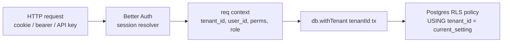

# Multi-tenancy & isolation

> **Status:** Stable. Required reading for anyone adding a table,
> API route, worker, or any code path that reaches the database.
>
> **Governed by:** ADR-0002 (Drizzle), ADR-0009 (Postgres + RLS),
> Plan §27, §45, §50. Hard rules in
> [`AGENTS.md` §8](../../AGENTS.md#8-architecture-hard-rules).

A tenant in TESKEL is an **organization** (Better Auth term), not a
user. A user can be a member of N orgs. Every row of every business
table either belongs to exactly one tenant or is explicitly a global
row (e.g. `feature_flags`, `marketplace_listings`).

Tenant isolation is the **single most important** invariant in the
platform. A bug here is always a Sev1 incident.

---

## 1. Identity flow (request → tenant)



1. Edge / Hono middleware resolves the session and sets:
   - `tenant_id` (UUID) — the active org.
   - `user_id` (UUID).
   - `permissions` (array, see [`rbac-matrix.md`](../security/rbac-matrix.md)).
   - `role` (string, e.g. `org.owner`).
2. The handler **must not** issue any `db.*` call directly. It calls
   `db.withTenant(tenantId, async (tx) => …)`.
3. `db.withTenant` issues `SET LOCAL app.tenant_id = $1` at the start
   of the transaction, then runs the closure, then commits.
4. RLS policies on every business table compare `tenant_id` column
   to `current_setting('app.tenant_id')::uuid`. Mismatch ⇒ row not
   visible / not writable.

If `tenant_id` is missing from the context, the handler throws a
`401` *before* any DB call.

---

## 2. Layered defenses (Swiss-cheese)

A request hostile to tenant isolation must pierce **all** of the
following layers, in order:

| Layer | Where | What it does |
| --- | --- | --- |
| 1. Auth gate | Better Auth middleware | Rejects unauthenticated requests; resolves user, org membership. |
| 2. Org gate | RBAC middleware | Verifies the resolved user is a member of the requested `tenant_id` *and* has the required permission. |
| 3. App context | `withTenant(tenantId, …)` wrapper | Sets the `app.tenant_id` GUC; this is the *only* place that sets it. |
| 4. RLS policy | Postgres | Even with elevated DB privileges, the row is filtered. |
| 5. Object storage | Signed URL helper | All R2 keys are scoped under `tenants/{tenantId}/…`; the helper refuses to sign for a different prefix. |
| 6. Queue routing | BullMQ producer | Every job carries `tenant_id` in payload; consumer wraps work in `withTenant` again. |
| 7. Outbox / external | outbox sender | The sender re-resolves tenant context before each call; never trusts a stale closure. |
| 8. Logs / traces | Logger + tracer | Every line is annotated with `tenant_id`; an alert fires if a span lacks one. |

**Defense in depth.** A vulnerability in any single layer must be
caught by at least one other.

---

## 3. Required RLS pattern (per business table)

Every business table follows this pattern:

```sql
-- 1. Column
tenant_id uuid not null references organizations(id) on delete restrict,

-- 2. Index for read performance
create index <table>_tenant_idx on <table> (tenant_id);

-- 3. Enable RLS (mandatory)
alter table <table> enable row level security;
alter table <table> force row level security;

-- 4. Policy: read
create policy <table>_select on <table>
  for select
  using (tenant_id = current_setting('app.tenant_id', true)::uuid);

-- 5. Policy: insert
create policy <table>_insert on <table>
  for insert
  with check (tenant_id = current_setting('app.tenant_id', true)::uuid);

-- 6. Policy: update
create policy <table>_update on <table>
  for update
  using (tenant_id = current_setting('app.tenant_id', true)::uuid)
  with check (tenant_id = current_setting('app.tenant_id', true)::uuid);

-- 7. Policy: delete
create policy <table>_delete on <table>
  for delete
  using (tenant_id = current_setting('app.tenant_id', true)::uuid);
```

The `add-table` skill scaffolds all of this. **Do not** hand-write a
table without running through that skill.

### Global / cross-tenant tables

A handful of tables are global by design:

- `organizations` — tenants themselves. Read with caller's
  `tenant_id`; write only via `system.platform_admin`.
- `users` — global; the join to a tenant is via `org_members`.
- `marketplace_listings` (Phase 3) — readable to all authenticated
  users, but writable only by the listing's `creator_org_id`.
- `feature_flags` — global registry; values evaluated per-tenant by
  PostHog.

Each of these has its **own** RLS policy stating the cross-tenant
intent in plain SQL. Do **not** disable RLS on them.

---

## 4. Required test coverage (per table / route)

Every PR that touches RLS must add:

1. A **happy-path** test: tenant A reads its own data.
2. A **cross-tenant negative** test: tenant A *cannot* read or
   modify tenant B's data. The test must run with B's UUID injected
   into the same query and assert zero rows / `42501` error.
3. A **bypass-attempt** test: the path-under-test does **not** call
   any `db` method outside `withTenant`. Static check via ESLint
   custom rule plus a runtime guard in `db` package (development
   builds throw if `app.tenant_id` is unset).

The `add-table` skill ships these tests as templates.

---

## 5. Worker / queue isolation

Every BullMQ producer call must include `tenant_id` in the payload:

```ts
await queue.add(
  "send-email",
  { tenantId, userId, templateId, data },
  { jobId: idempotencyKey }
);
```

Every consumer wraps the work in `withTenant`:

```ts
worker.process(async (job) => {
  const { tenantId, ... } = job.data;
  await db.withTenant(tenantId, async (tx) => {
    // …
  });
});
```

**Forbidden:** consumers reading `tenant_id` from a closure / module
scope. The worker MUST get it from the job payload every time, so
that retries from a fresh node still resolve the right tenant.

---

## 6. Cross-tenant operations (allowed list)

These are the only operations that legitimately *cross* tenants. All
of them are listed here so reviewers can spot un-listed crossings.

| Operation | Surface | Reason | Audit |
| --- | --- | --- | --- |
| Marketplace install | `POST /v1/marketplace/templates/:id/install` | Buyer tenant copies a listing from creator tenant. | `audit_log` row with both tenant IDs. |
| Marketplace fork | `POST /v1/marketplace/templates/:id/fork` | Same as install but creates a new draft for the buyer. | Same. |
| Support impersonation | Support console | `system.support_l2` may **read** another tenant's row to debug. Writes blocked. | `audit_log` + Slack ping in `#audit-impersonation`. |
| GDPR DSAR fulfilment | DSAR pipeline | Operator runs a script that reads across tenants by subject email. | `audit_log` + ticket ID. |
| System backfill | One-off jobs | Per `data-backfill-job` skill. Runs as `system` role; per-tenant scope still enforced inside the loop. | `audit_log` + run report. |
| Audit log query | Internal tool | `system.security_lead` may read across tenants for incident scoping. | Self-audited (the audit log audits itself via hash chain). |

If you find yourself adding a new cross-tenant operation, it is an
**ADR** (not a PR).

---

## 6a. Per-tenant resource quotas

Multi-tenancy is also about *fair share*, not only isolation. Every
tenant has documented quotas (Plan §70, [`docs/billing/plans.md`](../billing/plans.md)).
Enforcement points:

| Resource | Enforcement | Where |
| --- | --- | --- |
| LLM tokens / month | Budget guard (Sec. 3.2 of `c4.md`) | AI gateway, **before** call. |
| Workflow runs / month | Counter check before scheduling | API + workers. |
| Storage GB | Periodic reconciliation job | `apps/workers/reconcile-storage`. |
| API rate limit | Edge ratelimit per tenant + per IP | Hono middleware. |
| Sandbox concurrency | Token-bucket per tenant | Sandbox broker. |
| Outbound webhook calls / hour | Token-bucket per tenant + per destination | Outbox sender. |

A tenant exceeding quota gets a typed error (`QUOTA_EXCEEDED`) with
the next-reset time, **not** a silent drop.

---

## 7. PII boundaries

PII must be readable only inside `withTenant`. Logs, traces, error
reports must be scrubbed:

- **Logs / spans:** include `tenant_id`, never raw email / IP / name.
- **Sentry:** PII scrubbing on by default; do not pass user objects
  to `Sentry.captureException(err, { user })` unless redacted.
- **Audit log:** is internally PII-bearing by design; encrypted at
  rest; access gated to `system.security_lead`.
- **AI prompts:** the prompt registry strips PII unless the slot is
  explicitly marked `pii_allowed: true` (rare; reviewed by privacy).

---

## 8. Common mistakes (and how the system catches them)

| Mistake | Catch |
| --- | --- |
| Calling `db.select(…)` outside `withTenant`. | ESLint custom rule + runtime guard in `db` package. |
| Hard-coding a tenant in tests. | Test fixtures generate two tenants by default; cross-tenant assertion is mandatory in `add-table` skill template. |
| Using `tenant_id` from a closure inside a worker. | Code review (worker template forces destructuring from `job.data`). |
| Skipping RLS on a "small" table. | `add-table` skill won't pass review without it; CI sanity check inspects all tables for `enable row level security`. |
| Storing R2 objects with a tenant-less key. | Signed-URL helper rejects keys not under `tenants/{tenantId}/`. |
| Caching a row in Redis without tenant in key. | Cache keys include `tenant_id` by convention; lint rule flags missing. |
| Adding a "shared" table. | Reviewer requires an ADR explaining why it's global. |

---

## 9. References

- [`AGENTS.md` §8](../../AGENTS.md#8-architecture-hard-rules) — hard
  rules including RLS / withTenant.
- Plan §27 (multi-tenancy + RLS), §45 (threat model), §50 (data
  protection).
- [`docs/security/rbac-matrix.md`](../security/rbac-matrix.md) —
  permissions × roles × surfaces.
- [`threat-model.md`](./threat-model.md) — STRIDE per surface.
- `add-table` skill, `add-api-route` skill, `add-rbac-role` skill.
